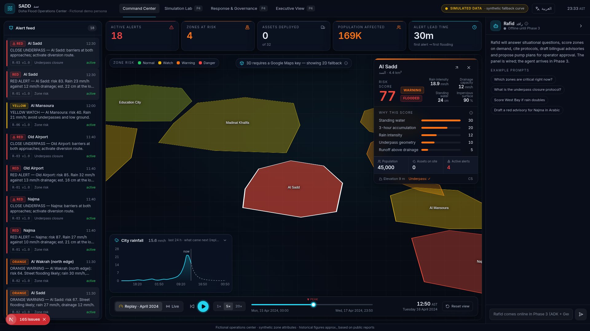

# PROJECT SADD (سد) — Urban Flood Command & Preparedness Twin

**An AI-powered flood operations digital twin for a Gulf city (Doha), built on a
photorealistic 3D city model, with real ML, a deterministic rules engine, an ADK agent,
custom MCP servers and visible governance.**

> Persona: the fictional *Doha Flood Operations Center (FOC)*. No real entity is depicted.
> Simulated data is labelled simulated; live data is labelled live — always, in the header.



*Phase 1 screenshot on the MapLibre fallback (no Google Maps key, and captured offline so no basemap tiles or extruded buildings). With
`NEXT_PUBLIC_GOOGLE_MAPS_KEY` set the same view renders on Google's `Map3DElement` — satellite imagery draped on terrain, because Google's
photorealistic building mesh does not cover Qatar yet; the same element lights up when it does.*

---

## The story (three acts, one click each)

| Act | Tab | What the room sees |
|-----|-----|--------------------|
| 1 — **Replay** | Command Center | 15–17 April 2024. Press play: rain climbs, zones turn yellow → orange → red on the 3D city, the rules engine fires alerts into the feed, the KPI strip moves. *"In 2024 the response was reactive."* |
| 2 — **Live** | Command Center | Flip the toggle: today's real Doha weather (Open-Meteo, no key), calm green city. Proves the pipeline is real. |
| 3 — **Simulate** | Simulation Lab | Storm ×1.5, pump-fleet allocator, Rafid proposes a plan, the operator **approves**, pumps move, time-to-drain drops. *(Phase 4)* |

## Why it matters

Gulf cities are hyper-arid and catastrophically flood-prone: rare rain lands on impervious
surfaces with under-built drainage and overwhelms it within hours. Response has been reactive.
SADD moves the city to **predictive** operations: zone-level risk hours ahead, pre-positioned
pump fleets, earlier alerts — with every consequential decision made by versioned rules and
logged, never by an LLM.

> **Decision principle** — "The LLM never makes the consequential decision. The rules engine
> decides; the agent explains, proposes, and cites. Everything is logged."

## Architecture (draft 1 — open source, local; GCP is a config story)

```
Next.js 15 (4 tabs + Rafid panel, AR/EN + RTL, Google Photorealistic 3D / MapLibre fallback)
        │ REST (SSE for the agent in Phase 3)
FastAPI  sadd/
 ├─ api/     zones · replay timeline · alerts · assets · rules · live weather · meta
 ├─ rules/   DETERMINISTIC engine — versioned pure functions; the ONLY writer of alerts
 ├─ sim/     physics_v0 baseline + April-2024 replay precompute (per-tick, smooth at 20×)
 ├─ models/  XGBoost risk nowcast + time-to-drain regressor            (Phase 2)
 └─ agent/   Rafid — Google ADK on Gemini, tools via MCP + local tools  (Phase 3)
PostgreSQL 16 + PostGIS + pgvector  (zones · rain · flood_state · assets · alerts ·
                                    decision_log · protocol_chunks · gauges)
MCP: MCP Toolbox for Databases → Postgres · flood-forecasting-mcp (custom, Phase 3)
External: Google Maps JS API (3D) · Gemini API · Open-Meteo (no key)
```

### Migration map

| Draft 1 (local, OSS) | GCP |
|---|---|
| Postgres + PostGIS | BigQuery (GEOGRAPHY) |
| scikit-learn / XGBoost | BigQuery ML (`CREATE MODEL` over the same tables) |
| pgvector RAG | Vertex AI Search |
| FastAPI | Cloud Run |
| ADK local runtime | Vertex AI Agent Engine (same agent code) |
| recharts Executive tab | Looker Studio embed |
| MCP Toolbox → Postgres | managed BigQuery MCP server |
| flood-forecasting-mcp (simulated) | same server, `FLOOD_MCP_BACKEND=live` |

## Quickstart

Prerequisites: Docker, Python 3.11+ (`uv` recommended), Node 20+.

```bash
cp .env.example .env                       # every key optional; app degrades gracefully
cp frontend/.env.local.example frontend/.env.local
make setup                                 # backend venv + frontend npm install
make db                                    # Postgres 16 + PostGIS + pgvector (docker compose)
make seed                                  # zones, April-2024 rain, replay precompute, rules, fleet, protocols
make dev                                   # FastAPI :8000 + Next.js :3000
```

Open <http://localhost:3000>. Press **play**. Space toggles playback.

`make test` runs the pytest suite (**28 tests** in Phase 1: physics baseline, every rule,
engine escalation/clear-down, replay math, API smoke).

### Keys (all optional — see `.env.example`)

| Variable | Purpose | Missing → |
|---|---|---|
| `NEXT_PUBLIC_GOOGLE_MAPS_KEY` | Google 3D map with risk-lit towers — imagery on terrain; no photorealistic mesh in Qatar yet (enable **Maps JavaScript API** + **Map Tiles API**) | dark 2D MapLibre fallback with a banner |
| `GEMINI_API_KEY` | Rafid (ADK) + embeddings (Phase 3) | Rafid shows an offline notice |
| — | Open-Meteo needs **no key** | seed falls back to a bundled synthetic storm curve, clearly labelled |

## Deploying (Railway)

Two services built from this repo: `sadd-db` (PostGIS + pgvector image, one volume) and
`sadd-app` (one container: FastAPI serving the API and the Next.js static export, seeding
itself on first boot). Steps and the full variable list: **[docs/DEPLOY_RAILWAY.md](docs/DEPLOY_RAILWAY.md)**.

## Data honesty

* **Rain**: `make seed` pulls hourly Doha precipitation for 15–17 April 2024 from Open-Meteo's
  ERA5 archive. If unreachable it uses `data/storm/april_2024_doha_hourly_fallback.csv`, a
  hand-designed curve shaped after public reporting — **not an observation**. The header pill
  names the active source. See `data/storm/README.md` (including a calibration note).
* **Zones**: twelve simplified district polygons with plausible synthetic attributes.
* **Risk (Phase 1)**: `physics_v0`, a transparent mass balance
  (`surface += (rain × imperviousness − drainage) × dt; depth = surface × concentration`)
  with a documented weighted score. The zone card shows the driver breakdown. Phase 2 trains
  the XGBoost nowcast on labels from this same generator. This is decision support, not a
  hydrological model — and the UI says so.
* **Historical figures** in copy are approximate, based on public reports.

## Governance made visible

Every alert in the feed carries its rule id and version (`R-01 v1.0`), and every decision
writes a `decision_log` row with the exact inputs snapshot the rule saw. Phase 1 rules:

| Rule | Plain language |
|---|---|
| R-06 v1.0 | risk ≥ 40 → YELLOW watch |
| R-02 v1.0 | risk ≥ 60 → ORANGE warning |
| R-01 v1.0 | risk ≥ 80 for 2 consecutive intervals → RED alert + advisory draft |
| R-03 v1.0 | RED + underpass zone → action item: close underpass, divert traffic |
| R-07 v1.0 | active alert AND risk < 40 for 60 min → clear + stand-down message |

R-04 (forecast pre-positioning) and R-05 (agent plan validation) arrive with the forecast model
and the agent. The agent can only *propose*; the single path to changing asset state is
`rules.validate_and_apply(plan, operator_id)` after an operator clicks APPROVE.

## Repository

```
├─ CLAUDE.md                 the spec (read first)
├─ docker-compose.yml        Postgres 16 + PostGIS + pgvector (docker/postgres/Dockerfile)
├─ Makefile                  setup · db · schema · seed · train · dev · test · lint · export · prod
├─ Dockerfile · railway.json production image (frontend build + FastAPI) for Railway / any Docker host
├─ backend/                  FastAPI — sadd/{api,rules,sim,models,agent}, sql/, tests/
├─ frontend/                 Next.js 15 · TypeScript strict · Tailwind 4 · zustand · SWR · recharts
├─ flood-forecasting-mcp/    custom MCP server (Phase 3)
├─ data/                     geojson · storm curve · fleet · protocols EN/AR
└─ docs/screenshots/
```

## Build order

| Phase | Deliverable | Status |
|---|---|---|
| P1 | scaffold · schema + seed · 3D map with risk-coloured zones · KPI strip · alert feed · replay scrubber · live mode · rules R-01/02/03/06/07 · AR/EN RTL | **done** |
| P2 | trained models · server-driven replay engine · R-04 · reactive-2024 fleet animation | next |
| P3 | flood-forecasting-mcp · MCP Toolbox · Rafid (6 tools, streaming, citations, approval flow) | |
| P4 | Simulation Lab · Response & Governance · Executive · polish | |
| P5 | rehearsal fixes only | |

---
*Fictional operations center for demonstration. Uses Google APIs; not endorsed by or affiliated with Google or any government entity.*

## Models and the what-if engine (Day 2)

Two real trained models, reproduced by `make train` in a few seconds (the Docker build does it):

* **Risk nowcast** — XGBoost on rain intensity, 3-hour accumulation, drainage capacity, imperviousness,
  elevation and underpass; labels from the transparent `physics_v0` runoff formula plus noise
  (holdout R² ≈ 0.98). It scores every tick of the April-2024 replay, and the zone card's "why is
  this zone red" shows its TreeSHAP contributions next to the physics drivers it learned from.
* **Time-to-drain** — gradient-boosted regressor around the hotspot mass balance
  `hours ≈ volume ÷ (pumps + local drainage − inflow)` (holdout R² ≈ 0.99). Pumps act where water
  collects — an 8,000 m² underpass basin — which is why a truck matters at an underpass and barely
  registers on a zone average.
* **What-if** — `POST /api/sim/simulate` takes the storm multiplier, pump trucks per zone and the two
  preparedness toggles and returns per-zone peak risk, depth, flooded hours and time-to-drain plus KPI
  deltas against the untouched baseline, in ~20 ms. `GET /api/models` reports which model scored the
  replay, its metrics and importances; with no artifacts everything falls back to the formulas and
  says so. Damage figures are illustrative constants and are labelled as such in the response.

## Rafid, the agent (Day 3)

Rafid (رافد, "tributary; one who supports") is a Google ADK agent on Gemini, docked on every tab.
It explains, proposes and cites; it never executes. Six capabilities, each a tool the panel shows
as a visible trace line ("Rafid used: flood-mcp → query_latest_flood_status(…)"):

| Tool | Backed by |
|---|---|
| Situational Q&A (`get_zone_status`, `list_zones_at_risk`, `get_active_alerts`, `get_kpis`, `get_decision_log`, `get_assets`) | **MCP Toolbox for Databases** (`backend/toolbox/tools.yaml`) over Postgres; the same queries run as local tools if Toolbox is down |
| Gauge status and forecasts | **flood-forecasting-mcp** — our MCP server built contract-first against Google's Flood Forecasting API, launched over stdio |
| `score_zone` | the XGBoost nowcast with TreeSHAP contributions |
| `search_protocols` | pgvector over Gemini embeddings when the corpus is embedded (`make embed`), Postgres keyword search otherwise — labelled either way |
| `propose_dispatch_plan` | greedy allocation over the what-if engine, returned as a plan card that needs the operator's **APPROVE**; rule **R-05** validates and applies it and logs the operator id |
| `draft_advisory` | bilingual SMS templates, returned marked **DRAFT**, never sent |

`POST /api/agent/chat` streams server-sent events (tool calls, results, citations, plans, drafts,
text). Without `GEMINI_API_KEY` the panel stays an honest shell. Rule **R-04** now also fires in the
replay: a pre-position recommendation hours before a zone's first orange alert, from a look-ahead
labelled "perfect foresight" in the ledger. GCP: the same ADK code on Vertex AI Agent Engine, the
Toolbox source pointed at BigQuery, Vertex AI Search for the corpus.

## Risk-lit towers (why the 3D buildings are ours)

Google's Photorealistic 3D Tiles do not cover Qatar, so `Map3DElement` draws satellite imagery on
terrain. The building volume on the map comes from OpenStreetMap instead: `backend/sadd/buildings.py`
pulls every footprint with a height (or level count) in central Doha from the Overpass API, keeps
towers of 30 m and up (about 400), tags each with the zone it stands in, and the frontend extrudes
them as translucent `Polygon3DElement`s. Towers in normal zones are calm glass; from the yellow band
up they take their zone's risk colour, so a district turning red lights up its skyline. The layer
fetches at Docker build time (`make buildings` locally), degrades to nothing if Overpass is down, and
can be toggled from the pill on the map. Data © OpenStreetMap contributors (ODbL), credited on the map.
The day Google adds Qatar to the photorealistic mesh, the same element shows it with no code change.
